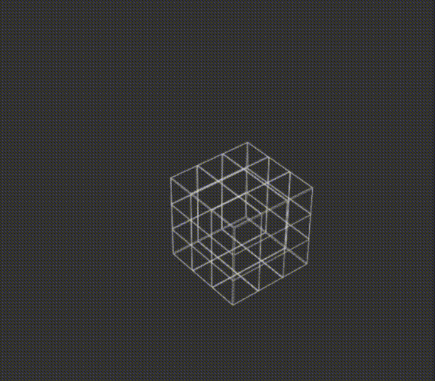

# 3D rotating cube

This project demonstrates the implementation of a 3D rotating cube using HTML and CSS. The cube rotates continuously around its axes, creating an eye-catching visual effect.

## Video Demo

This GIF provides a visual demonstration of the rotating cube functionality.

## Overview
The 3D rotating cube is constructed using HTML for the structure and CSS for styling and animations. The cube is composed of multiple faces stacked together with different transformations applied to simulate a three-dimensional object.

## How It Works
## HTML Structure
The index.html file contains the cube's structure. It features a container element with the class scene, which houses the cube element with the class cube. Within the cube element, there are several div elements representing the cube's faces.

## CSS Styling
In the style.css file, styles and animations for the cube are defined:

* Variables (:root): Custom CSS properties control various aspects of the cube, including face depth, size, cube size, perspective, and rotation angles.
* Cube Styles: The .cube class specifies the cube's basic styles, such as size, position, and the preserve-3d transform style to maintain its 3D appearance.
* Face Styles: The .face class defines the appearance of each face, including size, background color, and border.
* Face Transformations: Individual classes like .face_front, .face_back, .face_right, .face_left, .face_top, and .face_bottom determine the transformations applied to position each face correctly within 3D space.
* Animation (@keyframes): The @keyframes rule defines the rotateCube animation, continuously rotating the cube along the X and Y axes to create the spinning effect.

License
This project is licensed under the MIT License. You are free to use, modify, or distribute this code for any purpose. Refer to the LICENSE file for details.
